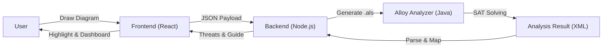

# AMADEUS (N2SF 지능형 감사 도구)

> [!IMPORTANT]
> **현재 개발 진행 중 (Work In Progress)**
> 이 프로젝트는 현재 활발히 개발 중이며, 기능이 변경되거나 불안정할 수 있습니다.
> This project is currently under active development. Features are subject to change and may be unstable.

---

# N2SF Intelligent Audit Tool


> **"The first automated threat modeling tool powered by Formal Verification(Alloy) to validate compliance with Korea's N2SF guidelines."**
>
> (한국의 N2SF 가이드라인 준수 여부를 검증하는 최초의 Alloy 정형 기법 기반 자동화 위협 식별 도구)

## 1. 배경 및 문제 정의 (Why this project?)

### Problem: 새로운 보안 패러다임과 검증의 복잡성
대한민국의 공공 보안 정책이 기존의 획일적인 '망 분리'에서 데이터 중요도에 따라 보안 대책을 차등 적용하는 국가 망 보안체계(National Network Security Framework)로 대전환하고자 하는 움직임이 보이고 있습니다. 새로운 체계는 업무 데이터를 **기밀(Classified)**, **민감(Sensitive)**, **공개(Open)**의 3등급으로 분류하고, 위치-주체-객체(Location-Subject-Object) 모델링을 통해 위협을 식별할 것을 요구합니다.

하지만 기존의 글로벌 모델링 도구(예: OWASP Threat Dragon)는 이러한 한국 고유의 다층 보안 등급 체계와 망 연계(CDS) 규칙을 검증할 수 없습니다. 또한, 복잡하게 얽힌 망 구성도에서 관리자가 수동으로 '정보 이동 원칙'이나 '정보 생산·저장 원칙' 위반을 찾아내는 것은 막대한 시간 소요와 인적 오류(Human Error)의 위험을 안고 있습니다.

### Solution: 정형 기법(Formal Methods)을 통한 규제 준수 자동화
본 프로젝트는 N2SF 가이드라인의 보안 원칙을 수학적 논리로 변환하고, Alloy Analyzer를 통해 이를 증명하는 방식을 도입했습니다. 사용자가 직관적인 UI로 망 구성을 그리면, 시스템은 이를 정형 모델로 변환하여 N2SF 규정 위반 여부를 전수 검사합니다. 이를 통해 보안 비전문가도 설계 단계에서부터 국가 가이드라인을 완벽하게 준수하는지 즉시 확인할 수 있는 지능형 보안 감사 시스템을 구축했습니다.

## 2. 주요 기능 (Key Features)

*   **9대 핵심 위협 자동 탐지**: 정보 유출(Leakage), 저장 데이터 암호화 미비, 관리자 접속 경로 위반 등 N2SF의 핵심 보안 위협을 자동으로 식별합니다.
*   **Smart Modeling System**: Drag & Drop 인터페이스를 통해 노드를 배치하면, 좌표를 기반으로 **망(Zone) 소속을 자동으로 인식**하여 모델링 편의성을 극대화했습니다.
*   **Formal Verification Engine**: 단순한 규칙 매칭이 아닌, Alloy의 SAT Solver를 활용하여 **다단계 연결(Multi-hop) 경로** 추적 및 논리적 모순을 검증합니다.
*   **Auto Remediation Guide**: 위협이 탐지되면 단순한 경고에 그치지 않고, "어떤 설정을 변경해야 하는지"에 대한 **구체적인 해결 가이드**를 제공합니다.
*   **Real-time Security Dashboard**: **보안 건전성**과 **모델링 완성도**를 실시간으로 수치화하여 보여줌으로써, 사용자가 현재 보안 수준을 직관적으로 파악할 수 있습니다.

## 3. 데모 (Demo)

<!-- GIF Placeholder -->

## 4. 기술 아키텍처 (Technical Architecture)

본 시스템은 확장성과 유지보수성을 고려하여 **3-Tier Architecture**로 설계되었습니다.

### Frontend (React Flow)
*   **UX 최적화**: 복잡한 망 구성을 쉽게 그릴 수 있도록 React Flow 기반의 직관적인 모델링 도구를 구현했습니다.
*   **Data Flow Animation**: 데이터의 이동 경로를 시각적으로 표현하여 흐름을 쉽게 파악할 수 있습니다.

### Backend (Node.js)
*   **Template Injection Engine**: 프론트엔드의 JSON 데이터를 받아 Alloy가 이해할 수 있는 `.als` 명세 코드로 변환하는 **무결점 코드 생성기**를 구축했습니다.
*   **Deterministic ID Generation**: 분석의 재현성을 보장하기 위해 결정론적 ID 생성 로직을 적용했습니다.

### Engine (Alloy Analyzer)
*   **SAT Solver 기반 검증**: 생성된 모델을 바탕으로 모든 가능한 반례(Counterexample)를 탐색하여 숨겨진 위협을 찾아냅니다.



## 5. 기술적 챌린지 (Technical Challenges & Solutions)

### Q: 왜 일반적인 코딩(JS/Python)이 아닌 Alloy를 사용했는가?
**A:** 망 분리 환경에서는 A에서 B로 직접 연결되지 않더라도, C와 D를 거쳐 우회적으로 연결되는 **추이적 관계**를 검증하는 것이 핵심입니다.
일반적인 알고리즘(DFS/BFS)으로 모든 우회 경로와 보안 등급 간의 간섭을 검증하려면 코드가 기하급수적으로 복잡해집니다. 본 프로젝트는 **관계 논리**에 특화된 Alloy를 도입하여, 복잡한 우회 경로 탐지 문제를 간결하고 정확하게 해결했습니다.

### Q: 비전문가가 난해한 Alloy 코드를 어떻게 다루는가?
**A:** 사용자는 Alloy를 전혀 알 필요가 없습니다. 사용자는 익숙한 GUI로 그림을 그리기만 하면 됩니다.
백엔드에 구축된 **Deterministic Template Engine**이 사용자 모델을 Alloy 코드로 트랜스파일링(Transpiling)하고, 분석 결과를 다시 알기 쉬운 언어로 변환하여 제공하는 **추상화 레이어**를 완벽하게 구현했습니다.

## 6. 설치 및 실행 (Getting Started)

### 사전 요구 사항 (Prerequisites)
*   **Node.js** (v16 이상)
*   **Java Runtime Environment (JRE)** (Alloy Analyzer 실행을 위해 필수)

### 설치 및 실행 (Installation & Run)

**1. 저장소 복제 (Clone Repository)**
```bash
git clone https://github.com/your-repo/otd-alloy.git
cd otd-alloy
```

**2. 백엔드 실행 (Backend)**
```bash
cd BACKEND
npm install
node server.js
# Server running on http://localhost:3001
```

**3. 프론트엔드 실행 (Frontend)**
```bash
cd FRONTEND_REACT
npm install
npm run dev
# Application running on http://localhost:5173
```

## 7. License & Acknowledgements

### License
This project is licensed under the **MIT License**. See the [LICENSE](LICENSE) file for details.

### Acknowledgements
본 프로젝트는 다음 오픈소스 프로젝트들의 기술과 개념을 바탕으로 구축되었습니다.
(This project was built using the following open-source technologies and concepts.)

* **[Alloy Analyzer](https://alloytools.org/)**: 본 프로젝트의 핵심 검증 엔진으로 탑재되었습니다. (Integrated as the core verification engine of this project.)
* **[React Flow](https://reactflow.dev/)**: 직관적인 다이어그램 모델링 UI를 구현하기 위한 핵심 라이브러리로 사용되었습니다. (Used as the core library to implement the intuitive diagram modeling UI.)
* **[OWASP Threat Dragon](https://owasp.org/www-project-threat-dragon/)**: 다이어그램 기반 위협 모델링의 개념과 접근 방식에 깊은 영감을 주었습니다. (Deeply inspired by the concept and approach of diagram-based threat modeling.)
